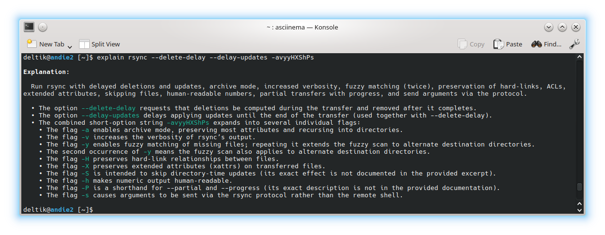
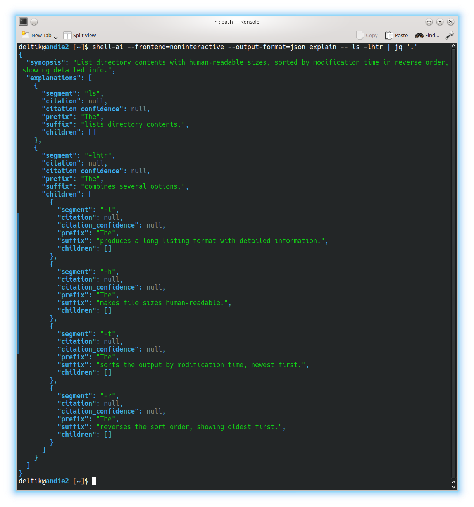
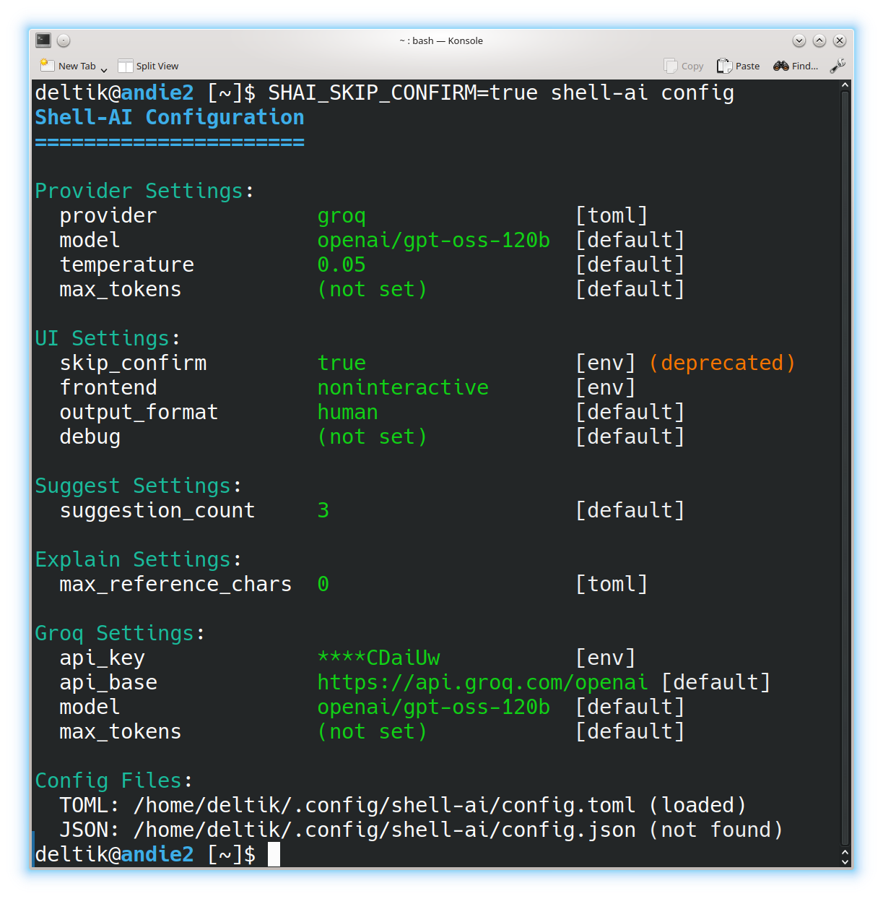

# Shell-AI

[](https://github.com/Deltik/shell-ai/releases)
[](https://crates.io/crates/shell-ai)
[](https://github.com/Deltik/shell-ai/releases)
[](https://crates.io/crates/shell-ai)
[](https://github.com/Deltik/shell-ai/actions/workflows/build.yaml)
[](https://opensource.org/licenses/MIT)
[](https://ko-fi.com/Deltik)

Describe what you want. Get shell commands. Or explain commands you don't understand.

## What It Does

**Suggest** (**`shell-ai suggest`** or **`shai`**) turns natural language into executable shell commands. Describe what you want in any language, and Shell-AI generates options you can run, copy, or refine.

**Explain** (**`shell-ai explain`**) breaks down shell commands into understandable parts, citing relevant man pages where possible. Useful for understanding unfamiliar commands or documenting scripts.

## Quick Start

```bash
# Install
cargo install shell-ai
ln -v -s shell-ai ~/.cargo/bin/shai  # Optional: shorthand alias for `shell-ai suggest`

# Configure
export SHAI_API_PROVIDER=openai
export OPENAI_API_KEY=sk-...

# Generate commands from natural language
shai "ファイルを日付順に並べる"  # Japanese: sort files by date

# Explain an existing command
shell-ai explain "tar -czvf archive.tar.gz /path/to/dir"
```

For guided configuration, run `shell-ai config init` to generate a documented config file.

## Installation

_After installing, [configure](#configuration) your AI provider. Then, consider adding [shell integrations](#shell-integration) for optional workflow enhancements._

### From GitHub Releases

Download prebuilt binaries from the [Releases page](https://github.com/Deltik/shell-ai/releases).

### From crates.io

```bash
cargo install shell-ai
ln -v -s shell-ai ~/.cargo/bin/shai
```

### From Source

```bash
git clone https://github.com/Deltik/shell-ai
cd shell-ai
cargo install --path .
# Installs to ~/.cargo/bin/shell-ai
ln -v -s shell-ai ~/.cargo/bin/shai
```

## Features

- **Single binary**: No Python, no runtime dependencies. Just one executable.
- **Shell integration**: Tab completions, aliases, and Ctrl+G keybinding via `shell-ai integration generate`.
- **Multilingual**: Describe tasks in any language the AI model understands.
- **Explain with citations**: `shell-ai explain` cites man pages, not just AI knowledge.
- **Multiple providers**: OpenAI, Azure OpenAI, Groq, Ollama (local), and Mistral.
- **Interactive workflow**: Select a suggestion, then explain it, execute it, copy it, or revise it.
- **Vim-style navigation**: j/k keys, number shortcuts (1-9), arrow keys.
- **Scriptable**: `--frontend=noninteractive` and `--output-format=json` for automation. Pipe commands to `shell-ai explain` via stdin.
- **Configuration introspection**: `shell-ai config` shows current settings and their sources.

Run `shell-ai --help` for all options, or `shell-ai config schema` for the full configuration reference.

## Showcase

### Suggest: XKCD #1168 (tar)

| [](https://xkcd.com/1168/) |
|:----------------------------------------------------------------------------------------------------------------------------------------------------------------------------------------------------------------------------------------------------------------------------------------------------------:|
|                                                                                        [](docs/images/suggest-tar.gif)                                                                                         |

### Explain: XKCD #1654 (Universal Install Script)

|                                                                                        [](https://xkcd.com/1654/)                                                                                        |
|:------------------------------------------------------------------------------------------------------------------------------------------------------------------------------------------------------------------------------------------------------------------------------------------------------------------------------------------------------------------------------------------------------------------------------------------------------------------------------:|
| [](docs/images/explain-1654.png) |

### Multilingual: Danish Skills (Flersproget: Danskkundskaber)

[](docs/images/suggest-danish.gif)

### Challenging Tasks

| Suggest                                                                           | Explain                                                                             |
|-----------------------------------------------------------------------------------|-------------------------------------------------------------------------------------|
| [](docs/images/suggest-perl.gif) | [](docs/images/explain-rsync.png) |

### JSON Output for Scripting

[](docs/images/explain-ls-lhtr.png)

### Configuration Introspection

[](docs/images/config.png)

## Configuration

Shell-AI loads configuration from multiple sources (highest priority first):

1. CLI flags (`--provider`, `--model`, etc.)
2. Environment variables (`SHAI_API_PROVIDER`, `OPENAI_API_KEY`, etc.)
3. Config file (see paths below)
4. Built-in defaults

Config file locations:
- **Linux**: `~/.config/shell-ai/config.toml`
- **macOS**: `~/Library/Application Support/shell-ai/config.toml`
- **Windows**: `%APPDATA%\shell-ai\config.toml`

Generate a documented config template:

```bash
shell-ai config init
```

Example config:

```toml
provider = "openai"

[openai]
api_key = "sk-..."
model = "gpt-4o"
```

### Providers

Set the provider in your config file (`~/.config/shell-ai/config.toml` on Linux, `~/Library/Application Support/shell-ai/config.toml` on macOS, `%APPDATA%\shell-ai\config.toml` on Windows). The provider-specific settings go in a section named after the provider.

```toml
provider = "openai"  # or: groq, azure, ollama, mistral
```

Shell-AI may alternatively be configured by environment variables, which override the config file:

<details>
<summary>Environment variables</summary>

```bash
export SHAI_API_PROVIDER=openai  # or: groq, azure, ollama, mistral
```

</details>

#### OpenAI

Works with OpenAI and any OpenAI-compatible API (e.g., DeepSeek).

<details>
<summary>TOML config</summary>

```toml
[openai]
api_key = "sk-..."  # REQUIRED
# api_base = "https://api.openai.com"  # change for compatible APIs
# model = "gpt-5"
# max_tokens = ""
# organization = ""  # for multi-org accounts
```

</details>

<details>
<summary>Environment variables</summary>

```bash
export OPENAI_API_KEY=sk-...  # REQUIRED
# export OPENAI_API_BASE=https://api.openai.com
# export OPENAI_MODEL=gpt-5
# export OPENAI_MAX_TOKENS=
# export OPENAI_ORGANIZATION=
```

</details>

#### Groq

<details>
<summary>TOML config</summary>

```toml
[groq]
api_key = "gsk_..."  # REQUIRED
# api_base = "https://api.groq.com/openai"
# model = "openai/gpt-oss-120b"
# max_tokens = ""
```

</details>

<details>
<summary>Environment variables</summary>

```bash
export GROQ_API_KEY=gsk_...  # REQUIRED
# export GROQ_MODEL=openai/gpt-oss-120b
# export GROQ_MAX_TOKENS=
```

</details>

#### Azure OpenAI

<details>
<summary>TOML config</summary>

```toml
[azure]
api_key = "your-key"  # REQUIRED
api_base = "https://your-resource.openai.azure.com"  # REQUIRED
deployment_name = "your-deployment"  # REQUIRED
# api_version = "2023-05-15"
# max_tokens = ""
```

</details>

<details>
<summary>Environment variables</summary>

```bash
export AZURE_API_KEY=your-key  # REQUIRED
export AZURE_API_BASE=https://your-resource.openai.azure.com  # REQUIRED
export AZURE_DEPLOYMENT_NAME=your-deployment  # REQUIRED
# export OPENAI_API_VERSION=2023-05-15
# export AZURE_MAX_TOKENS=
```

</details>

#### Ollama

No API key required for local Ollama.

<details>
<summary>TOML config</summary>

```toml
[ollama]
# api_base = "http://localhost:11434"
# model = "gpt-oss:120b-cloud"
# max_tokens = ""
```

</details>

<details>
<summary>Environment variables</summary>

```bash
# export OLLAMA_API_BASE=http://localhost:11434
# export OLLAMA_MODEL=gpt-oss:120b-cloud
# export OLLAMA_MAX_TOKENS=
```

</details>

#### Mistral

<details>
<summary>TOML config</summary>

```toml
[mistral]
api_key = "your-key"  # REQUIRED
# api_base = "https://api.mistral.ai"
# model = "codestral-2508"
# max_tokens = ""
```

</details>

<details>
<summary>Environment variables</summary>

```bash
export MISTRAL_API_KEY=your-key  # REQUIRED
# export MISTRAL_API_BASE=https://api.mistral.ai
# export MISTRAL_MODEL=codestral-2508
# export MISTRAL_MAX_TOKENS=
```

</details>

## Shell Integration

Shell-AI works well standalone, but integrating it into your shell enables any or all of these streamlined workflows:

- **Tab completion** for shell-ai commands
- **Aliases** as shorthands for shell-ai commands:
  - **`??`** alias for `shell-ai suggest --`
  - **`explain`** alias for `shell-ai explain --`
- **Ctrl+G** keybinding to transform the current line into a shell command

### Setup

Generate an integration file for your shell:

```bash
# Generate with default features (completions + aliases)
shell-ai integration generate bash

# Or with all features including Ctrl+G keybinding
shell-ai integration generate bash --preset full
```

Then add the source line to your shell config as instructed.

**Available presets:**

| Feature                         | `minimal` | `standard` | `full` |
|---------------------------------|:---------:|:----------:|:------:|
| Tab completions                 |     ✓     |     ✓      |   ✓    |
| Aliases (`??`, `explain`)       |           |     ✓      |   ✓    |
| Ctrl+G keybinding for `suggest` |           |            |   ✓    |

Default: `standard`

**Customization examples:**

```bash
# Standard preset plus keybinding
shell-ai integration generate zsh --preset standard --add keybinding

# Full preset without aliases
shell-ai integration generate fish --preset full --remove aliases

# Update all installed integrations after upgrading shell-ai
shell-ai integration update

# View available features and installed integrations
shell-ai integration list
```

**Alternative: eval on startup (not recommended)**

Instead of generating a static file, you can eval the integration directly in your shell config:

```bash
# Bash/Zsh
eval "$(shell-ai integration generate bash --preset=full --stdout)"

# Fish
shell-ai integration generate fish --preset=full --stdout | source

# PowerShell
Invoke-Expression (shell-ai integration generate powershell --preset=full --stdout | Out-String)
```

This approach doesn't write files to your config directory and is always up to date after upgrading Shell-AI, but adds several milliseconds to shell startup (the time to spawn Shell-AI and generate the integration). The file-based approach above is recommended for faster startup.

### Performance

The shell integration file is pre-compiled to minimize shell startup overhead. Here are benchmark results comparing the overhead of each preset.

<details>
<summary>Benchmark Results</summary>

This is how much slower Shell-AI v0.5.1's shell integration makes shell startup:

#### Baseline: Sourcing an Empty File

| Shell      |    N |     Min |      Q1 |  Median |      Q3 |     Max |    Mean | Std Dev |
|------------|-----:|--------:|--------:|--------:|--------:|--------:|--------:|--------:|
| Bash       | 1000 |  1.06ms |  1.18ms |  1.21ms |  1.31ms |  2.95ms |  1.27ms |  0.16ms |
| Zsh        | 1000 |  1.17ms |  1.33ms |  1.37ms |  1.45ms |  4.87ms |  1.42ms |  0.23ms |
| Fish       | 1000 |  0.78ms |  0.88ms |  0.91ms |  0.96ms |  2.69ms |  0.94ms |  0.12ms |
| PowerShell |  100 | 79.03ms | 81.09ms | 82.48ms | 84.91ms | 98.50ms | 83.32ms |  3.31ms |

#### Incremental Overhead (Above Baseline)

| Shell      | Preset   | Overhead (Mean) |
|------------|----------|----------------:|
| Bash       | minimal  |         +1.56ms |
| Bash       | standard |         +1.64ms |
| Bash       | full     |         +2.11ms |
| Zsh        | minimal  |         +1.98ms |
| Zsh        | standard |         +2.05ms |
| Zsh        | full     |         +2.43ms |
| Fish       | minimal  |         +2.42ms |
| Fish       | standard |         +2.56ms |
| Fish       | full     |         +2.69ms |
| PowerShell | minimal  |        +20.30ms |
| PowerShell | standard |        +21.67ms |
| PowerShell | full     |       +125.24ms |

#### Total Overhead (What Users Experience)

##### Bash

| Preset           |    N |    Min |     Q1 | Median |     Q3 |    Max |   Mean | Std Dev |
|------------------|-----:|-------:|-------:|-------:|-------:|-------:|-------:|--------:|
| blank (baseline) | 1000 | 1.06ms | 1.18ms | 1.21ms | 1.31ms | 2.95ms | 1.27ms |  0.16ms |
| minimal          | 1000 | 2.55ms | 2.71ms | 2.78ms | 2.89ms | 3.85ms | 2.82ms |  0.17ms |
| standard         | 1000 | 2.62ms | 2.76ms | 2.85ms | 2.98ms | 6.08ms | 2.91ms |  0.25ms |
| full             | 1000 | 2.97ms | 3.22ms | 3.32ms | 3.47ms | 6.55ms | 3.38ms |  0.26ms |

##### Zsh

| Preset           |    N |    Min |     Q1 | Median |     Q3 |    Max |   Mean | Std Dev |
|------------------|-----:|-------:|-------:|-------:|-------:|-------:|-------:|--------:|
| blank (baseline) | 1000 | 1.17ms | 1.33ms | 1.37ms | 1.45ms | 4.87ms | 1.42ms |  0.23ms |
| minimal          | 1000 | 3.03ms | 3.27ms | 3.35ms | 3.47ms | 5.07ms | 3.40ms |  0.20ms |
| standard         | 1000 | 3.07ms | 3.32ms | 3.41ms | 3.55ms | 5.86ms | 3.47ms |  0.25ms |
| full             | 1000 | 3.40ms | 3.69ms | 3.80ms | 3.94ms | 6.20ms | 3.85ms |  0.27ms |

##### Fish

| Preset           |    N |    Min |     Q1 | Median |     Q3 |    Max |   Mean | Std Dev |
|------------------|-----:|-------:|-------:|-------:|-------:|-------:|-------:|--------:|
| blank (baseline) | 1000 | 0.78ms | 0.88ms | 0.91ms | 0.96ms | 2.69ms | 0.94ms |  0.12ms |
| minimal          | 1000 | 3.03ms | 3.19ms | 3.27ms | 3.44ms | 4.64ms | 3.36ms |  0.26ms |
| standard         | 1000 | 3.15ms | 3.29ms | 3.40ms | 3.64ms | 5.50ms | 3.50ms |  0.29ms |
| full             | 1000 | 3.30ms | 3.45ms | 3.53ms | 3.70ms | 5.58ms | 3.63ms |  0.27ms |

##### PowerShell

| Preset           |   N |      Min |       Q1 |   Median |       Q3 |      Max |     Mean | Std Dev |
|------------------|----:|---------:|---------:|---------:|---------:|---------:|---------:|--------:|
| blank (baseline) | 100 |  79.03ms |  81.09ms |  82.48ms |  84.91ms |  98.50ms |  83.32ms |  3.31ms |
| minimal          | 100 |  96.98ms | 101.39ms | 103.04ms | 105.27ms | 118.27ms | 103.62ms |  3.95ms |
| standard         | 100 |  99.77ms | 103.34ms | 104.47ms | 106.13ms | 115.67ms | 104.98ms |  3.12ms |
| full             | 100 | 200.65ms | 205.15ms | 207.09ms | 209.94ms | 241.00ms | 208.55ms |  5.94ms |

#### Methodology

To reproduce these benchmarks, run `cargo run --package xtask -- bench-integration [sample_count]` from this repository.

</details>

## Migrating from Python Shell-AI

If you're coming from [ricklamers/shell-ai](https://github.com/ricklamers/shell-ai):

- **The provider is required.** Set `SHAI_API_PROVIDER` explicitly, as the default is no longer Groq.
- **`SHAI_SKIP_HISTORY` is removed.** Writing to shell history is no longer supported. The previous implementation made assumptions about the shell's history configuration. Shells don't expose history hooks to child processes, making this feature infeasible.
- **`SHAI_SKIP_CONFIRM` is deprecated.** Use `--frontend=noninteractive` or `SHAI_FRONTEND=noninteractive` as a more flexible alternative.
- **Context mode is deprecated.** The `--ctx` flag and `CTX` environment variable still work but are not recommended. The extra context from shell output tends to confuse the completion model rather than help it.
- **Model defaults differ.** Set `model` explicitly if you prefer a specific model.

## Contributing

Contributions welcome! Open an [issue](https://github.com/Deltik/shell-ai/issues) or [pull request](https://github.com/Deltik/shell-ai/pulls) at [Deltik/shell-ai](https://github.com/Deltik/shell-ai).

For changes to the original Python Shell-AI, head upstream to [ricklamers/shell-ai](https://github.com/ricklamers/shell-ai).

## Acknowledgments

This project began as a fork of [ricklamers/shell-ai](https://github.com/ricklamers/shell-ai) at [v0.4.4](https://github.com/Deltik/shell-ai/releases/tag/v0.4.4). Since [v0.5.0](https://github.com/Deltik/shell-ai/releases/tag/v0.5.0), it shares no code with the original—a complete [Ship of Theseus](https://en.wikipedia.org/wiki/Ship_of_Theseus) rebuild in Rust. The hull is new, but the spirit remains.

## License

Shell-AI is licensed under the MIT License. See [LICENSE](LICENSE) for details.
