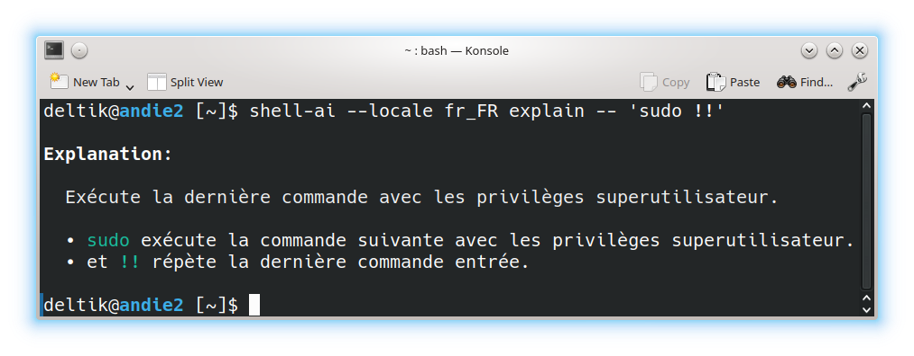
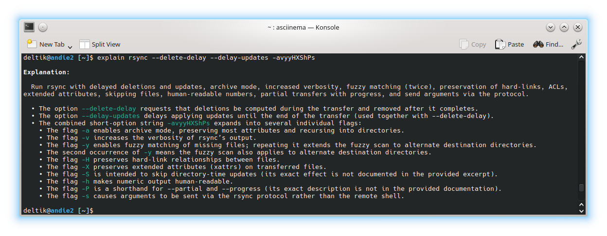
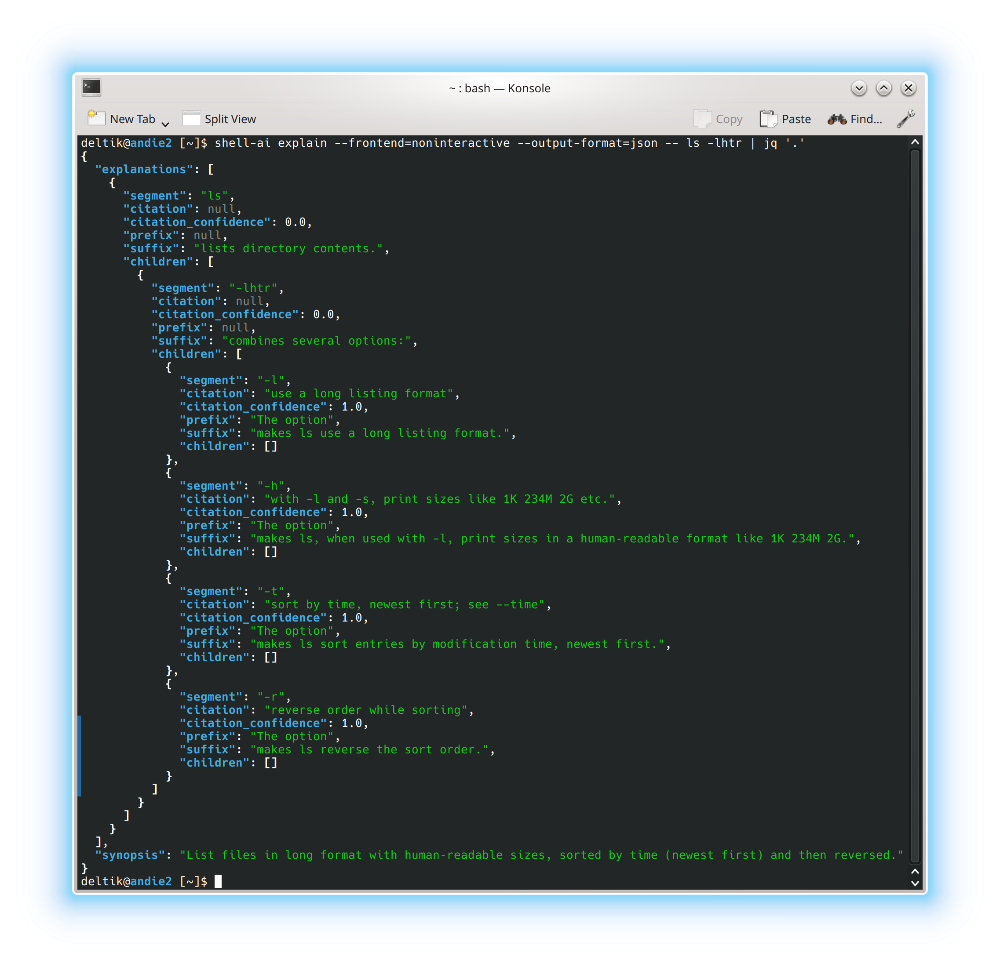
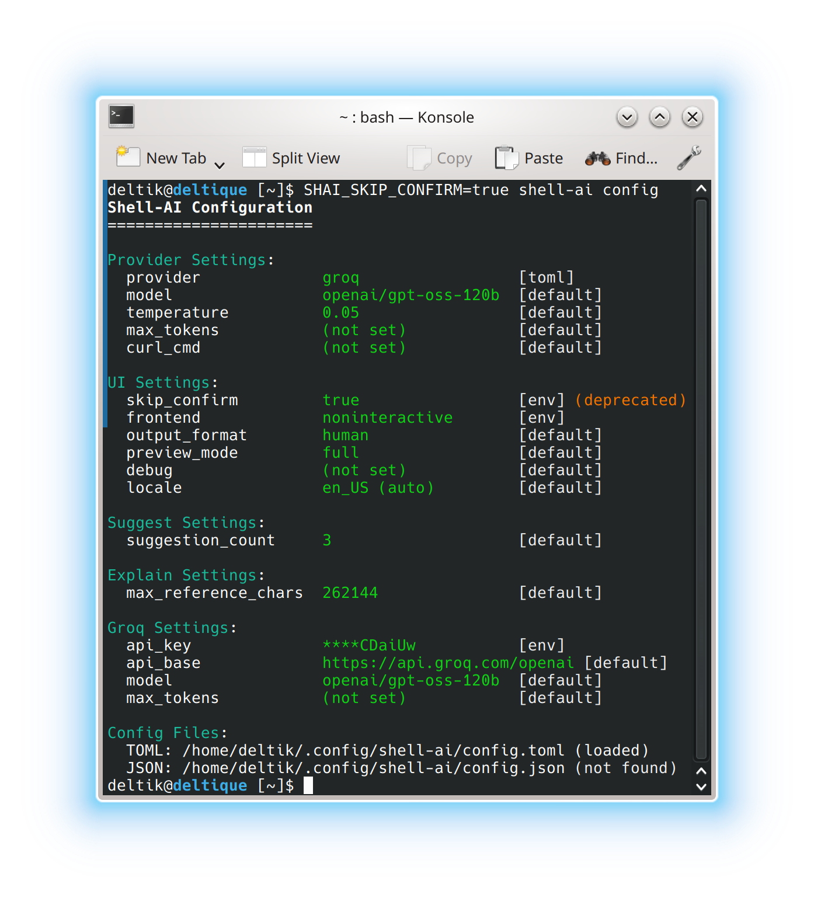

# Shell-AI

[](https://github.com/Deltik/shell-ai/releases)
[](https://crates.io/crates/shell-ai)
[](https://github.com/Deltik/shell-ai/releases)
[](https://crates.io/crates/shell-ai)
[](https://github.com/Deltik/shell-ai/actions/workflows/build.yaml)
[](https://opensource.org/licenses/MIT)
[](https://ko-fi.com/Deltik)

Describe what you want. Get shell commands. Or explain commands you don't understand.

## What It Does

**Suggest** (**`shell-ai suggest`** or **`shai`**) turns natural language into executable shell commands. Describe what you want in any language, and Shell-AI generates options you can run, copy, or refine.

**Explain** (**`shell-ai explain`**) breaks down shell commands into understandable parts, citing relevant man pages where possible. Useful for understanding unfamiliar commands or documenting scripts.

## Quick Start

```bash
# Install
cargo install shell-ai
ln -v -s shell-ai ~/.cargo/bin/shai  # Optional: shorthand alias for `shell-ai suggest`

# Configure
export SHAI_API_PROVIDER=openai
export OPENAI_API_KEY=sk-...

# Generate commands from natural language
shai "ファイルを日付順に並べる"  # Japanese: sort files by date

# Explain an existing command
shell-ai explain "tar -czvf archive.tar.gz /path/to/dir"
```

For guided configuration, run `shell-ai config init` to generate a documented config file.

## Installation

> [!TIP]
> After installing, [configure](#configuration) your AI provider. Then, consider adding [shell integrations](#shell-integration) for optional workflow enhancements.

### From GitHub Releases

Download prebuilt binaries from the [Releases page](https://github.com/Deltik/shell-ai/releases).

### From crates.io

```bash
cargo install shell-ai
ln -v -s shell-ai ~/.cargo/bin/shai  # Optional: shorthand alias for `shell-ai suggest`
```

### From Source

```bash
git clone https://github.com/Deltik/shell-ai
cd shell-ai
cargo install --path .
# Installs to ~/.cargo/bin/shell-ai
ln -v -s shell-ai ~/.cargo/bin/shai  # Optional: shorthand alias for `shell-ai suggest`
```

## Features

- **Single binary:** No Python, no runtime dependencies. Just one executable.
- **Shell integration:** Tab completions, aliases, and Ctrl+G keybinding via `shell-ai integration generate`.
- **Multilingual:** Describe tasks in any language the AI model understands. Responses adapt to your system locale.
- **Explain from `man`:** `shell-ai explain` includes grounding from man pages, not just AI knowledge.
- **Multiple providers:** OpenAI, Azure OpenAI, Anthropic, Claude Code CLI, OpenAI Codex CLI – plus OpenAI-compatible services (Groq, Ollama, Mistral) and Anthropic-compatible services (Ollama v0.14.0+).
- **Interactive workflow:** Select a suggestion, then explain it, execute it, copy it, or revise it.
- **Live streaming previews:** Watch suggestions and explanations generate token-by-token instead of waiting for the full response.
- **Vim-style navigation:** j/k keys, number shortcuts (1-9), arrow keys.
- **Scriptable:** `--frontend=noninteractive` and `--output-format=json` for automation. Pipe commands to `shell-ai explain` via stdin.
- **Configuration introspection:** `shell-ai config` shows current settings and their sources.

Run `shell-ai --help` for all options, or `shell-ai config schema` for the full configuration reference.

## Showcase

### Suggest: XKCD #1168 (tar)

| [](https://xkcd.com/1168/) |
|:----------------------------------------------------------------------------------------------------------------------------------------------------------------------------------------------------------------------------------------------------------------------------------------------------------:|
|                                                                                        [](docs/images/suggest-tar.gif)                                                                                         |

### Explain: XKCD #1654 (Universal Install Script)

|                                                                                        [](https://xkcd.com/1654/)                                                                                        |
|:------------------------------------------------------------------------------------------------------------------------------------------------------------------------------------------------------------------------------------------------------------------------------------------------------------------------------------------------------------------------------------------------------------------------------------------------------------------------------:|
| [](docs/images/explain-1654.png) |

### Multilingual

| Suggest in Danish (Foreslå på dansk)                                                                                                                     | Explain in French (Expliquer en français)                                                                                                             |
|----------------------------------------------------------------------------------------------------------------------------------------------------------|-------------------------------------------------------------------------------------------------------------------------------------------------------|
| [](docs/images/suggest-danish.gif) | [](docs/images/explain-french-sudo-last-command.png) |

### Challenging Tasks

| Suggest                                                                                                                                                                                                            | Explain                                                                                                                                 |
|--------------------------------------------------------------------------------------------------------------------------------------------------------------------------------------------------------------------|-----------------------------------------------------------------------------------------------------------------------------------------|
| [](docs/images/suggest-perl.gif) | [](docs/images/explain-rsync.png) |

### JSON Output for Scripting

[](docs/images/explain-ls-lhtr.png)

### Configuration Introspection

[](docs/images/config.png)

## Configuration

Shell-AI loads configuration from multiple sources (highest priority first):

1. CLI flags (`--provider`, `--model`, etc.)
2. Environment variables (`SHAI_API_PROVIDER`, `OPENAI_API_KEY`, etc.)
3. Legacy JSON config file (`config.json`, same directory as TOML config file; see below)
4. TOML config file (`config.toml`; see paths below)
5. Built-in defaults

Config file locations:
- **Linux**: `~/.config/shell-ai/config.toml`
- **macOS**: `~/Library/Application Support/shell-ai/config.toml`
- **Windows**: `%APPDATA%\shell-ai\config.toml`

Generate a documented config template:

```bash
shell-ai config init
```

Example config:

```toml
provider = "openai"

[openai]
api_key = "sk-..."
model = "gpt-4o"
```

<details>
<summary>Legacy JSON config (from ricklamers/shell-ai)</summary>

A `config.json` in the same directory is also supported for compatibility with [ricklamers/shell-ai](https://github.com/ricklamers/shell-ai). It uses environment variable names as keys in a flat JSON object:

```json
{
  "SHAI_API_PROVIDER": "openai",
  "OPENAI_API_KEY": "sk-..."
}
```

TOML-style keys also work in the JSON file:

```json
{
  "provider": "openai",
  "openai": {
    "api_key": "sk-...",
    "model": "gpt-4o"
  }
}
```

When both styles set the same setting, env-var-style keys take precedence.

The JSON file takes precedence over the TOML file (matching how environment variables override config files). Settings from the TOML file still apply for anything not set in the JSON file.

</details>

### Providers

Set the provider in your config file:

- **Linux:** `~/.config/shell-ai/config.toml`
- **macOS:** `~/Library/Application Support/shell-ai/config.toml`
- **Windows:** `%APPDATA%\shell-ai\config.toml`

The provider-specific settings go in a section named after the provider.

```toml
provider = "openai"  # or: anthropic, claudecode, codex
```

Shell-AI may alternatively be configured by environment variables, which override the config file:

```bash
export SHAI_API_PROVIDER=openai  # or: anthropic, claudecode, codex
```

> [!TIP]
> Run `shell-ai config schema` to see all available settings and their defaults.

#### OpenAI-Compatible Providers

The providers `openai`, `groq`, `ollama`, and `mistral` all use the OpenAI chat completions API format.
They share the same configuration structure and support `temperature` and `max_tokens` settings.

| Provider  | Environment Variables                                                                           |
|-----------|-------------------------------------------------------------------------------------------------|
| `openai`  | `OPENAI_API_KEY`, `OPENAI_API_BASE`, `OPENAI_MODEL`, `OPENAI_MAX_TOKENS`, `OPENAI_ORGANIZATION` |
| `groq`    | `GROQ_API_BASE`, `GROQ_API_KEY`, `GROQ_MODEL`, `GROQ_MAX_TOKENS`                                |
| `ollama`  | `OLLAMA_API_BASE`, `OLLAMA_MODEL`, `OLLAMA_MAX_TOKENS`                                          |
| `mistral` | `MISTRAL_API_KEY`, `MISTRAL_API_BASE`, `MISTRAL_MODEL`, `MISTRAL_MAX_TOKENS`                    |

> [!NOTE]
> `provider = "openai"` works with any OpenAI-compatible API.
> 
> The main differences from other OpenAI-compatible providers are the default API base URLs and models.

<details>
<summary>OpenAI / Any OpenAI-compatible API</summary>

```toml
[openai]
api_key = "sk-..."
# api_base = "https://api.openai.com"  # change for compatible APIs
# model = ""
# max_tokens = ""
# organization = ""  # for multi-org accounts
```

```bash
export OPENAI_API_KEY=sk-...
# export OPENAI_API_BASE=https://api.openai.com
# export OPENAI_MODEL=
# export OPENAI_MAX_TOKENS=
# export OPENAI_ORGANIZATION=
```

</details>

<details>
<summary>Groq</summary>

```toml
[groq]
api_key = "gsk_..."
# api_base = "https://api.groq.com/openai"
# model = ""
# max_tokens = ""
```

```bash
export GROQ_API_KEY=gsk_...
# export GROQ_API_BASE=https://api.groq.com/openai
# export GROQ_MODEL=
# export GROQ_MAX_TOKENS=
```

</details>

<details>
<summary>Ollama</summary>

```toml
[ollama]
# api_base = "http://localhost:11434"
# model = ""
# max_tokens = ""
```

```bash
# export OLLAMA_API_BASE=http://localhost:11434
# export OLLAMA_MODEL=
# export OLLAMA_MAX_TOKENS=
```

</details>

<details>
<summary>Mistral</summary>

```toml
[mistral]
api_key = "your-key"
# api_base = "https://api.mistral.ai"
# model = ""
# max_tokens = ""
```

```bash
export MISTRAL_API_KEY=your-key
# export MISTRAL_API_BASE=https://api.mistral.ai
# export MISTRAL_MODEL=
# export MISTRAL_MAX_TOKENS=
```

</details>

#### Azure OpenAI

Azure OpenAI uses a different URL structure with deployment names instead of model selection.

<details>
<summary>Configuration</summary>

```toml
[azure]
api_key = "your-key"  # REQUIRED
api_base = "https://your-resource.openai.azure.com"  # REQUIRED
deployment_name = "your-deployment"  # REQUIRED
# api_version = "2023-05-15"
# max_tokens = ""
```

```bash
export AZURE_API_KEY=your-key  # REQUIRED
export AZURE_API_BASE=https://your-resource.openai.azure.com  # REQUIRED
export AZURE_DEPLOYMENT_NAME=your-deployment  # REQUIRED
# export OPENAI_API_VERSION=2023-05-15
# export AZURE_MAX_TOKENS=
```

</details>

#### Anthropic

Use the native Anthropic Messages API as an alternative to the OpenAI chat completions API.

> [!NOTE]
> `provider = "anthropic"` works with any Anthropic-compatible API, like [Ollama v0.14.0](https://github.com/ollama/ollama/releases/tag/v0.14.0).

<details>
<summary>Configuration</summary>

```toml
[anthropic]
api_key = "sk-ant-..."
# api_base = "https://api.anthropic.com"
# model = ""
# max_tokens = ""
```

```bash
export ANTHROPIC_API_KEY=sk-ant-...
# export ANTHROPIC_API_BASE=https://api.anthropic.com
# export ANTHROPIC_MODEL=
# export ANTHROPIC_MAX_TOKENS=
```

</details>

#### Claude Code

Uses the [Claude Code CLI](https://docs.anthropic.com/en/docs/claude-code) in non-interactive mode.
No API key or login configuration needed; Claude Code manages its own authentication.

<details>
<summary>Configuration</summary>

```toml
[claudecode]
# cli_path = "claude"  # path to claude executable
# model = ""           # e.g., haiku, sonnet, opus
```

```bash
# export CLAUDE_CODE_CLI_PATH=claude
# export CLAUDE_CODE_MODEL=
```

**Requirements:** Claude Code CLI installed and authenticated (`claude` command available in PATH, or specify full path via `cli_path`).

</details>

#### OpenAI Codex

Uses the [OpenAI Codex CLI](https://github.com/openai/codex) in non-interactive mode (`codex exec --json`).
No API key or login configuration is needed in Shell-AI; Codex manages its own authentication via `codex login` or `OPENAI_API_KEY`.

Shell-AI runs Codex in a locked-down mode (read-only sandbox, agent tools disabled), so it only writes answers and never runs commands on your machine.

> [!NOTE]
> Codex sends its built-in agent instructions with every request (roughly 10,000 input tokens at the time of writing), so each call uses more quota than a plain API call. Choose this provider to reuse a ChatGPT/Codex subscription instead of paying for a separate OpenAI API key.

<details>
<summary>Configuration</summary>

```toml
[codex]
# cli_path = "codex"  # codex executable; multi-word commands work too,
                      # e.g. cli_path = "npx @openai/codex@latest"
# model = ""          # e.g., gpt-5.4-mini; empty = your Codex default
```

```bash
# export CODEX_CLI_PATH=codex
# export CODEX_MODEL=
```

**Requirements:** Codex CLI installed and authenticated. Either:

- Install globally (e.g. `npm install -g @openai/codex` or `brew install codex`), then run `codex login`.
- Or set `cli_path = "npx @openai/codex@latest"` to invoke it via `npx` without a global install.

</details>

### Model Effort

Most modern models can trade answer quality against speed and cost. The optional `effort` setting passes your preferred level through to the provider:

```toml
effort = "low"  # applies to whichever provider is active
```

```bash
export SHAI_EFFORT=low   # global
export CODEX_EFFORT=low  # or per provider: OPENAI_EFFORT, ANTHROPIC_EFFORT, CLAUDE_CODE_EFFORT, ...
```

```bash
shai --effort=low 'list files larger than 1MB'  # one-off override
```

A per-provider value can also go in the provider's config section, e.g. `[codex]` `effort = "low"`.

Lower effort means lower latency and cheaper responses—recommended for quick command suggestions. Shell-AI sends the value as it is, and the provider validates it.

### Advanced

#### Custom cURL Binary

Shell-AI uses a built-in HTTP client ([ureq](https://crates.io/crates/ureq) with rustls) by default. For situations where you need more control over the HTTP transport, you can configure Shell-AI to use an external `curl`-compatible binary instead.

##### Use Cases

- **TLS fingerprint bypass:** Some API providers ([like Groq](https://web.archive.org/web/20260325030530/https://megalodon.jp/2026-0325-1204-25/https://community.groq.com:443/t/ip-address-range-blocked-by-cloudflare/728)) use Cloudflare bot protection that fingerprints TLS handshakes. The built-in client's TLS fingerprint can be detected and blocked. [curl-impersonate](https://github.com/lexiforest/curl-impersonate) mimics real browser TLS fingerprints to bypass this.
- **Client certificates:** Authenticate to APIs that require mTLS.
- **Custom TLS settings:** Use specific cipher suites, TLS versions, or CA bundles.
- **Network debugging:** Route through a verbose proxy or log request details.
- **Corporate proxies:** Use NTLM or Kerberos proxy authentication that the built-in client doesn't support.

##### Configuration

```bash
# Environment variable
export SHAI_CURL=curl-impersonate

# Or in config.toml
curl_cmd = "curl-impersonate"
```

The command is parsed using POSIX shell quoting rules, so extra arguments work naturally:

```bash
export SHAI_CURL='curl --cacert /path/to/custom-ca.pem'
```

The configured binary must accept standard curl flags (`-s`, `-S`, `-i`, `--no-buffer`, `-H`, `-d @-`, `--max-time`). Shell-AI passes the request body via stdin and reads the response (headers + body) from stdout.

##### With [curl-impersonate](https://github.com/lexiforest/curl-impersonate)

```bash
# Install curl-impersonate (https://github.com/lexiforest/curl-impersonate)
# Then configure Shell-AI to use it:
export SHAI_CURL=curl-impersonate
export CURL_IMPERSONATE=firefox147  # browser to impersonate (handled by curl-impersonate, not Shell-AI)
```

> [!TIP]
> Shell-AI also auto-detects `libcurl-impersonate.so` at runtime (including via `LD_PRELOAD`) and uses it without any configuration. The `curl_cmd` setting is for when you want to use a specific binary or pass extra arguments.

<details>
<summary>curl-impersonate libcurl Example</summary>

Before:

```shell
deltik@box53 [~]$ shell-ai suggest -- 'get boot time in UTC'
Error: No suggestions could be generated.
Reason: API error: HTTP 403: {"error":{"message":"Access denied. Please check your network settings."}}
```

After:

```shell
deltik@box53 [~]$ LD_PRELOAD=/tmp/curl-impersonate/build/curl-8_15_0/lib/.libs/libcurl-impersonate.so.4.8.0 CURL_IMPERSONATE=firefox147 shell-ai suggest -- 'get boot time in UTC'
Select a command:
  [1] date -u -d @$(($(date +%s) - $(awk '{print int($1)}' /proc/uptime)))
   2  date -u -d "$(who -b | awk '{print $3\" \" $4}')" +"%Y-%m-%d %H:%M:%S %Z"
   3  date -u -d @$(($(date +%s) - $(awk '{print int($1)}' /proc/uptime))) +"%Y-%m-%d %H:%M:%S UTC"
   g  Generate new suggestions
   n  Enter a new command
   q  Quit

↑↓/jk navigate • key/Enter select • Esc quit
```

</details>

##### HTTP Backend Priority

Shell-AI will try the following HTTP backends in order:

1. `curl_cmd` / `SHAI_CURL`: Configured curl-compatible binary (subprocess)
2. `libcurl-impersonate.so`: Auto-detected library (in-process, zero config)
3. Built-in ureq: Default, always available

## Shell Integration

Shell-AI works well standalone, but integrating it into your shell enables any or all of these streamlined workflows:

- **Tab completion** for shell-ai commands
- **Aliases** as shorthands for shell-ai commands:
  - **`??`** alias for `shell-ai suggest --`
  - **`explain`** alias for `shell-ai explain --`
- **Ctrl+G** keybinding to transform the current line into a shell command

### Setup

Generate an integration file for your shell:

```bash
# Generate with default features (completions + aliases)
shell-ai integration generate bash

# Or with all features including Ctrl+G keybinding
shell-ai integration generate bash --preset full
```

Then add the source line to your shell config as instructed.

**Available presets:**

| Feature                         | `minimal` | `standard` | `full` |
|---------------------------------|:---------:|:----------:|:------:|
| Tab completions                 |     ✓     |     ✓      |   ✓    |
| Aliases (`??`, `explain`)       |           |     ✓      |   ✓    |
| Ctrl+G keybinding for `suggest` |           |            |   ✓    |

Default: `standard`

**Customization examples:**

```bash
# Standard preset plus keybinding
shell-ai integration generate zsh --preset standard --add keybinding

# Full preset without aliases
shell-ai integration generate fish --preset full --remove aliases

# Update all installed integrations after upgrading shell-ai
shell-ai integration update

# View available features and installed integrations
shell-ai integration list
```

**Alternative: eval on startup (not recommended)**

Instead of generating a static file, you can eval the integration directly in your shell config:

```bash
# Bash/Zsh
eval "$(shell-ai integration generate bash --preset=full --stdout)"
eval "$(shell-ai integration generate zsh --preset=full --stdout)"

# Fish
shell-ai integration generate fish --preset=full --stdout | source

# PowerShell
Invoke-Expression (shell-ai integration generate powershell --preset=full --stdout | Out-String)
```

This approach doesn't write files to your config directory and is always up to date after upgrading Shell-AI, but adds several milliseconds to shell startup (the time to spawn Shell-AI and generate the integration). The file-based approach above is recommended for faster startup.

### Performance

The shell integration file is pre-compiled to minimize shell startup overhead. Here are benchmark results comparing the overhead of each preset.

<details>
<summary>Benchmark Results</summary>

This is how much slower Shell-AI v0.7.1's shell integration makes shell startup:

#### Baseline: Sourcing an Empty File

| Shell      |    N |     Min |      Q1 |  Median |      Q3 |     Max |    Mean | Std Dev |
|------------|-----:|--------:|--------:|--------:|--------:|--------:|--------:|--------:|
| Bash       | 1000 |  0.76ms |  1.14ms |  1.46ms |  1.81ms |  2.52ms |  1.48ms |  0.37ms |
| Zsh        | 1000 |  0.59ms |  1.02ms |  1.09ms |  1.18ms |  2.07ms |  1.13ms |  0.20ms |
| Fish       | 1000 |  0.61ms |  0.89ms |  0.97ms |  1.06ms |  2.08ms |  0.99ms |  0.15ms |
| PowerShell |  100 | 40.03ms | 41.55ms | 42.54ms | 45.37ms | 65.86ms | 44.08ms |  4.26ms |

#### Incremental Overhead (Above Baseline)

| Shell      | Preset   | Overhead (Mean) |
|------------|----------|----------------:|
| Bash       | minimal  |         +1.56ms |
| Bash       | standard |         +1.34ms |
| Bash       | full     |         +1.82ms |
| Zsh        | minimal  |         +2.09ms |
| Zsh        | standard |         +2.07ms |
| Zsh        | full     |         +2.36ms |
| Fish       | minimal  |         +1.78ms |
| Fish       | standard |         +1.98ms |
| Fish       | full     |         +2.05ms |
| PowerShell | minimal  |        +12.91ms |
| PowerShell | standard |        +14.38ms |
| PowerShell | full     |        +62.35ms |

#### Total Overhead (What Users Experience)

##### Bash

| Preset           |    N |    Min |     Q1 | Median |     Q3 |    Max |   Mean | Std Dev |
|------------------|-----:|-------:|-------:|-------:|-------:|-------:|-------:|--------:|
| blank (baseline) | 1000 | 0.76ms | 1.14ms | 1.46ms | 1.81ms | 2.52ms | 1.48ms |  0.37ms |
| minimal          | 1000 | 1.82ms | 2.61ms | 2.85ms | 3.28ms | 5.16ms | 3.04ms |  0.70ms |
| standard         | 1000 | 1.88ms | 2.50ms | 2.75ms | 2.95ms | 5.24ms | 2.82ms |  0.54ms |
| full             | 1000 | 2.10ms | 2.85ms | 3.18ms | 3.44ms | 6.17ms | 3.30ms |  0.69ms |

##### Zsh

| Preset           |    N |    Min |     Q1 | Median |     Q3 |     Max |   Mean | Std Dev |
|------------------|-----:|-------:|-------:|-------:|-------:|--------:|-------:|--------:|
| blank (baseline) | 1000 | 0.59ms | 1.02ms | 1.09ms | 1.18ms |  2.07ms | 1.13ms |  0.20ms |
| minimal          | 1000 | 2.26ms | 2.89ms | 3.08ms | 3.31ms | 17.03ms | 3.22ms |  0.73ms |
| standard         | 1000 | 2.27ms | 2.94ms | 3.13ms | 3.32ms |  6.06ms | 3.20ms |  0.51ms |
| full             | 1000 | 2.44ms | 3.26ms | 3.45ms | 3.61ms |  6.56ms | 3.49ms |  0.47ms |

##### Fish

| Preset           |    N |    Min |     Q1 | Median |     Q3 |    Max |   Mean | Std Dev |
|------------------|-----:|-------:|-------:|-------:|-------:|-------:|-------:|--------:|
| blank (baseline) | 1000 | 0.61ms | 0.89ms | 0.97ms | 1.06ms | 2.08ms | 0.99ms |  0.15ms |
| minimal          | 1000 | 2.05ms | 2.40ms | 2.52ms | 3.13ms | 5.57ms | 2.76ms |  0.55ms |
| standard         | 1000 | 2.08ms | 2.47ms | 2.65ms | 3.43ms | 7.23ms | 2.97ms |  0.71ms |
| full             | 1000 | 2.28ms | 2.58ms | 2.71ms | 3.43ms | 6.56ms | 3.04ms |  0.71ms |

##### PowerShell

| Preset           |   N |      Min |       Q1 |   Median |       Q3 |      Max |     Mean | Std Dev |
|------------------|----:|---------:|---------:|---------:|---------:|---------:|---------:|--------:|
| blank (baseline) | 100 |  40.03ms |  41.55ms |  42.54ms |  45.37ms |  65.86ms |  44.08ms |  4.26ms |
| minimal          | 100 |  53.05ms |  54.47ms |  55.76ms |  58.28ms |  94.71ms |  56.99ms |  4.97ms |
| standard         | 100 |  53.36ms |  55.57ms |  57.44ms |  59.95ms |  87.91ms |  58.47ms |  5.07ms |
| full             | 100 | 100.02ms | 102.02ms | 103.46ms | 107.74ms | 172.52ms | 106.43ms | 10.15ms |

#### Methodology

To reproduce these benchmarks, run `cargo run --package xtask -- bench-integration [sample_count]` from this repository.

</details>

## Migrating from Python Shell-AI

If you're coming from [ricklamers/shell-ai](https://github.com/ricklamers/shell-ai):

- **The provider is required.** Set `SHAI_API_PROVIDER` explicitly, as the default is no longer Groq.
- **`SHAI_SKIP_HISTORY` is removed.** Writing to shell history is no longer supported. The previous implementation made assumptions about the shell's history configuration. Shells don't expose history hooks to child processes, making this feature infeasible.
- **`SHAI_SKIP_CONFIRM` is deprecated.** Use `--frontend=noninteractive` or `SHAI_FRONTEND=noninteractive` as a more flexible alternative.
- **Context mode is deprecated.** The `--ctx` flag and `CTX` environment variable still work but are not recommended. The extra context from shell output tends to confuse the completion model rather than help it.
- **Model defaults differ.** Set `model` explicitly if you prefer a specific model.

## Contributing

Contributions welcome! Open an [issue](https://github.com/Deltik/shell-ai/issues) or [pull request](https://github.com/Deltik/shell-ai/pulls) at [Deltik/shell-ai](https://github.com/Deltik/shell-ai).

For changes to the original Python Shell-AI, head upstream to [ricklamers/shell-ai](https://github.com/ricklamers/shell-ai).

## Acknowledgments

This project began as a fork of [ricklamers/shell-ai](https://github.com/ricklamers/shell-ai) at [v0.4.4](https://github.com/Deltik/shell-ai/releases/tag/v0.4.4). Since [v0.5.0](https://github.com/Deltik/shell-ai/releases/tag/v0.5.0), it shares no code with the original—a complete [Ship of Theseus](https://en.wikipedia.org/wiki/Ship_of_Theseus) rebuild in Rust. The hull is new, but the spirit remains.

## License

Shell-AI is licensed under the MIT License. See [LICENSE](LICENSE) for details.
